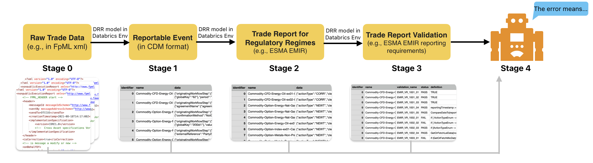

[](https://finosfoundation.atlassian.net/wiki/display/FINOS/Incubating)

# FINOS DTCC Hackathon 


## AI-Powered Digital Regulatory Reporting
**Quality and Compliance Masters**


### Project Details
Digital Regulatory Reporting is messy. It is because organizations may internally handle attributes and fields of a trade differently. 

Here we demonstate that it is possible to create a linkage from the unstructured regulatory text, to data model, to a specific field and interpretation. And based on the linkage and quality check, we can utilize AI tools to further understand the data quality and errors, assisting in reproting and solving these errors.

Here shows the workflows and its feasibility is verified in the Databricks environment.


### Team Information
Team POC: Josh Seidel

Team POC GitHib: josh-seidel-db

Team members:
* Brian Bussing (doesn’t have Github)
* Jordan Kramer (jordankramerdbx)
* Antoine Amend (@aamend)
* PJ Di Giammarino (pj@jwg-it.eu) (does not have Github)
* Luca Borella (luca.borella@finos.org) - Will not be participating in this, but will share the project with them.
* Minesh Patel (minesh.patel@regnosys.com)
* Xiaoyang Liu (xl2427@columbia.edu) 
* Keyi Wang (kw2914@columbia.edu)
* Sarah Huang (xh2404@columbia.edu)
* Kaiwen He (hek3@rpi.edu)
* Charie Shen (cs4206@columbia.edu)
* Colin Lin (shengyu3@andrew.cmu.edu)
* Felix Tian (tianf2@rpi.edu)
* Ruoyu Xiang (xry0408@gmail.com)


## Using DCO to sign your commits

**All commits** must be signed with a DCO signature to avoid being flagged by the DCO Bot. This means that your commit log message must contain a line that looks like the following one, with your actual name and email address:

```
Signed-off-by: John Doe <john.doe@example.com>
```

Adding the `-s` flag to your `git commit` will add that line automatically. You can also add it manually as part of your commit log message or add it afterwards with `git commit --amend -s`.

See [CONTRIBUTING.md](./.github/CONTRIBUTING.md) for more information

### Helpful DCO Resources
- [Git Tools - Signing Your Work](https://git-scm.com/book/en/v2/Git-Tools-Signing-Your-Work)
- [Signing commits
](https://docs.github.com/en/github/authenticating-to-github/signing-commits)


## License

Copyright 2025 FINOS

Distributed under the [Apache License, Version 2.0](http://www.apache.org/licenses/LICENSE-2.0).

SPDX-License-Identifier: [Apache-2.0](https://spdx.org/licenses/Apache-2.0)


